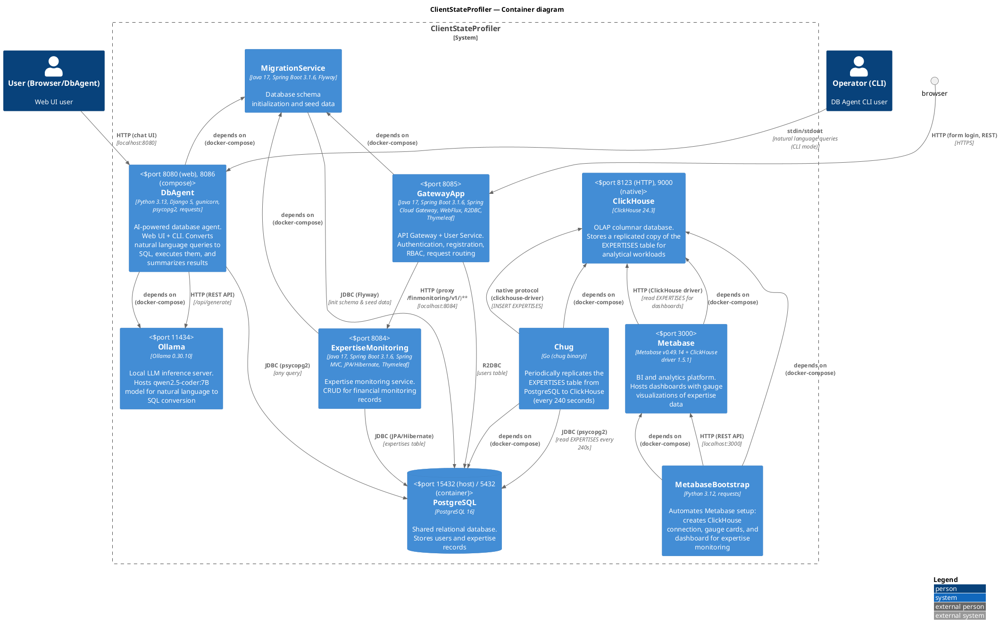

# ClientStateProfiler Architecture

## Overview

**ClientStateProfiler** is an educational Java/Python microservice project for monitoring the state of financial institution clients. The system provides user management and expertise (financial monitoring) records with role-based access control, is augmented with a Metabase BI dashboard (backed by ClickHouse) for visualizing expertise data, and replicates the expertise table to ClickHouse (OLAP) for analytical workloads.

---

## PlantUML Architecture Diagram



---

## Component Breakdown

### 1. GatewayApp (Gateway + User Service)

| Characteristic | Value |
|---|---|
| Port | `8085` |
| Technologies | Spring Cloud Gateway, WebFlux, R2DBC, Reactive Spring Security, Thymeleaf, Lombok, Jasypt |
| Stack | **Reactive Stack** |

**Responsibilities:**
- User authentication (form login with Spring Security)
- New user registration (POST `/users/v1/users`)
- Request proxying to ExpertiseMonitoring via `/finmonitoring/v1/**`
- Role-Based Access Control (RBAC):
    - `ROLE_USER` — basic access
    - `ROLE_MONITORING_USER` — access to financial monitoring service
    - `ROLE_ADMIN` — full access to all users

**Key classes:**
| Class | Purpose |
|---|---|
| `GatewayApp.java` | Entry point, `@SpringBootApplication`, `@EnableEncryptableProperties` |
| `SecurityConfiguration.java` | WebFlux Security configuration: filter chain setup, endpoint access rules |
| `SecurityPathsProperties.java` | External security path configuration via `security.paths.*` in `application.yml` |
| `PassConfiguration.java` | `PasswordEncoder` bean (BCrypt) |
| `AuthController.java` | REST API `/users/v1/users` — user CRUD |
| `IndexController.java` | Login page rendering `/login` |
| `SignUpController.java` | Registration page rendering `/signup` |
| `AboutMeController.java` | Current user info display `/users/v1/user_authorities` |
| `UserServiceImpl.java` | `ReactiveUserDetailsService` and `UserService` implementation |
| `UserRepo.java` | Reactive CRUD Repository (R2DBC) |
| `User.java` | User entity, implements `UserDetails` |
| `UserDto.java` | Record for user data transfer |
| `UserRequestBody.java` | Record for registration request body |
| `UserRoles.java` | Enum with roles |
| `UserAlreadyExistException.java` | Exception for duplicate login |

---

### 2. ExpertiseMonitoring (Expertise Monitoring Service)

| Characteristic | Value |
|---|---|
| Port | `8084` |
| Technologies | Spring MVC, JPA/Hibernate, Thymeleaf, Validation, Lombok, Jasypt |
| Stack | **Servlet Stack** |

**Responsibilities:**
- CRUD operations for financial monitoring expertise records
- Search expertises by ID and ClientId
- Display results via Thymeleaf templates

**Key classes:**
| Class | Purpose |
|---|---|
| `MonitoringExpertiseApplication.java` | Entry point |
| `MonitoringExpertiseConfiguration.java` | Configuration: `HiddenHttpMethodFilter` for `PATCH`/`DELETE` support in forms |
| `ExpertiseMonitoringController.java` | MVC controller: `GET/POST/PATCH/DELETE /finmonitoring/v1/expertises` |
| `ExpertiseMonitoringServiceImpl.java` | Service implementation with transactional logic |
| `ExpertiseMonitoringRepository.java` | JPA Repository with `findByClientId`, `deleteById` methods |
| `ExpertiseMonitoring.java` | JPA entity for `EXPERTISES` table |
| `ExpertiseMonitoringDto.java` | Record for expertise data transfer |
| `ExpertiseType.java` | Enum of expertise types: `TURNOVER_INCREASE`, `ACCOUNT_LOCK`, `SUPPLIER_LOSS` |

**Thymeleaf templates:**
| Template | Purpose |
|---|---|
| `expertises_main.html` | Main menu of the expertise service |
| `found_res.html` | Search results (table with records) |
| `save_res.html` | New expertise creation form |
| `upd_res.html` | Expertise editing form |

---

### 3. MigrationService (Migration Service)

| Characteristic | Value |
|---|---|
| Technologies | Spring Boot, Flyway, PostgreSQL JDBC |
| Type | **Ephemeral** (terminates after migration) |
| Dependency | Starts after PostgreSQL is healthy |

**Responsibilities:**
- Database schema creation (tables `USERS` and `EXPERTISES`)
- Initial seed data population

**Migrations:**
| File | Description |
|---|---|
| `V01__CREATE_USERS.sql` | Insert test users (Leo, Max, Marco, Karl) with BCrypt passwords |
| `V02__CREATE_EXPERTISES.sql` | Insert test expertise records (5 entries) |
| `V03__UPDATE_EXPERTISES.sql` | Insert 1000+ expanded expertise records with varied types, statuses, and timestamps spanning June–August 2026 for richer dashboard analytics |

---

### 4. DbAgent (AI-Powered Database Agent)

| Characteristic | Value |
|---|---|
| Web UI Port | `8080` (gunicorn), `8086` (docker-compose mapping with host networking) |
| Interfaces | **Django Web UI** (browser chat) + **Interactive CLI** |
| Technologies | Python 3.13, Django 5, gunicorn, whitenoise, psycopg2, requests (Ollama REST client) |
| Dependency | Starts after PostgreSQL is healthy + Ollama is healthy |

**Purpose:** Natural language interface to the database — available both via browser and command line. Users describe what data they need in plain text (Russian/English), and DbAgent:
1. Generates a SQL query using a local LLM (Ollama with `qwen2.5-coder:7B`)
2. Executes the SQL against PostgreSQL
3. Summarizes the results back in natural language

**Architecture — two external dependencies:**
- **Ollama** (port `11434`) — local LLM inference server running `qwen2.5-coder:7B` model
- **PostgreSQL** (port `15432`) — the shared database

**Dual Interface:**
- **Web UI** (primary): Django-based chat interface at `http://localhost:8080` served by gunicorn
  - Real-time status indicators for Ollama and PostgreSQL connections
  - Chat-based interaction with step visualization (1/3 Generate SQL → 2/3 Execute → 3/3 Summarize)
  - Results displayed in a table with configurable row limits (max 5 shown by default)
  - Keyboard shortcuts: Ctrl+R (check status), Ctrl+L (clear conversation)
  - Ability to pull Ollama model from the UI
  - API endpoints: `GET /api/status`, `POST /api/query`, `POST /api/pull-model`
- **CLI** (alternative): Interactive shell via `src/main.py` — run directly in the container with `docker exec -it db_agent python main.py`

**Key source files:**
| File | Purpose |
|---|---|
| **Core pipeline** | |
| `src/main.py` | Entry point, interactive CLI loop. Orchestrates the 3-step pipeline (generate SQL → execute → summarize) |
| `src/llm_client.py` | Ollama API client: `query_ollama()` for text generation, `extract_sql_from_response()` for parsing SQL from markdown, `wait_for_ollama()`, `pull_model()` |
| `src/db_connector.py` | PostgreSQL connector via `psycopg2`. `execute_sql_query()` runs any SQL and returns `(rows, column_names)` |
| `src/prompt_templates.py` | LLM prompt templates and DB schema definition (`DB_SCHEMA`, `SQL_GENERATION_PROMPT`, `SUMMARY_PROMPT`) |
| **Web UI (Django)** | |
| `manage.py` | Django management command-line utility |
| `web/settings.py` | Django settings: Whitenoise for static files, timezone Europe/Moscow, DbAgent-specific settings (`DBAGENT_OLLAMA_TIMEOUT`, `DBAGENT_MAX_RETRIES`) |
| `web/urls.py` | URL routing: `/` (chat UI), `/api/query`, `/api/status`, `/api/pull-model` |
| `web/views.py` | Views: `index()` renders chat page, `api_query()` runs pipeline, `api_status()` checks connections, `api_pull_model()` pulls Ollama model |
| `web/agent_service.py` | Wraps the core pipeline into reusable functions for the web interface (`run_pipeline`, `check_connections`, `pull_ollama_model`) |
| `web/wsgi.py` | WSGI entry point for gunicorn |
| `web/templates/web/index.html` | Chat UI template with status bar, message area, results table, input field |
| `web/static/web/css/style.css` | Styles for the chat interface |
| `web/static/web/js/main.js` | Frontend JavaScript: query submission, status polling, result rendering, keyboard shortcuts |

**Workflow (`run_agent` pipeline — same for both interfaces):**
1. User enters a natural language query (e.g. *"покажи всех пользователей"*, *"find all expertises for client X"*)
2. **SQL Generation** — `SQL_GENERATION_PROMPT` + `DB_SCHEMA` are sent to Ollama, SQL is extracted from the response
3. **SQL Execution** — the extracted SQL is executed via `psycopg2` against PostgreSQL
4. **Result Summarization** — the first 5 result rows + total row count are sent back to Ollama with `SUMMARY_PROMPT` for a human-readable answer (with password masking enforced)
5. Output is displayed to the user (in chat UI or CLI)

**Security:**
- Password column (`password` in `USERS` table) is never displayed — the summary prompt explicitly instructs the LLM to mask it as `******`
- The SQL prompt is restricted by the provided schema; no DDL/DCL operations are allowed by default

---

### 5. Metabase (BI and Analytics Platform)

| Characteristic | Value |
|---|---|
| Port | `3000` (host networking) |
| Image | `docker/metabase/Dockerfile` (Metabase v0.49.14 + ClickHouse driver 1.5.1) |
| Type | **Persistent** (metabase_data volume for application DB) |
| Dependency | Starts after ClickHouse is healthy |

**Purpose:** Self-service BI and analytics platform that connects to the shared ClickHouse database and provides interactive dashboards for monitoring expertise data. The expertise health dashboard displays gauge cards visualizing key metrics from the `EXPERTISES` table.

**Responsibilities:**
- Hosts a ClickHouse database connection to the replicated `EXPERTISES` table
- Serves BI dashboards with real-time gauge visualizations
- Provides a web-based analytics UI for operational monitoring

**Dashboard — Expertise Health Overview:**
| Card | SQL Query | Display |
|---|---|---|
| Total Expertises Over Time (Monthly) | `SELECT toStartOfMonth(dt_expertise_status) AS month, status, count(*) AS total_expertises FROM expertises GROUP BY month, status ORDER BY month, status;` | Line chart showing expertise count over time, grouped by month and status |
| Total Expertises | `SELECT toInt32(count(*)) AS total_expertises FROM expertises;` | Gauge showing total record count |
| Closed Expertises (%) | `SELECT COALESCE(round(countIf(status = 'CLOSED') * 100 / nullIf(count(*), 0), 2), 0) AS closed_percentage FROM expertises;` | Gauge showing percentage of closed records |
| Total Expertises Current Month | `SELECT toInt32(count(*)) AS total_expertises FROM expertises WHERE dt_expertise_status >= toStartOfMonth(today());` | Gauge showing total record count for the current month |
| Closed Expertises Current Month (%) | `SELECT COALESCE(round(countIf(status = 'CLOSED') * 100 / nullIf(count(*), 0), 2), 0) AS closed_percentage FROM expertises WHERE dt_expertise_status >= toStartOfMonth(today());` | Gauge showing percentage of closed records for the current month |

---

### 6. MetabaseBootstrap (Metabase Setup Automation)

| Characteristic | Value |
|---|---|
| Image | `python:3.12-slim` (inline command) |
| Script | `docker/metabase/bootstrap.py` |
| Type | **Ephemeral** (terminates after setup completes) |
| Dependency | Starts after Metabase is started and ClickHouse is healthy |

**Purpose:** Automates the initial configuration of Metabase so that dashboards are ready immediately without manual setup. The bootstrap script is written in Python 3.12 and uses the `requests` library to interact with the Metabase REST API.

**Workflow (`bootstrap.py`):**
1. **Wait for Metabase** — polls `/api/health` until Metabase reports `status: "ok"` (timeout: 600 seconds)
2. **Login or Setup** — attempts to authenticate with existing credentials; if that fails and a `setup-token` is available, runs the first-time setup (creates admin user, configures ClickHouse database connection, sets site preferences)
3. **Ensure Database** — checks `/api/database` for an existing ClickHouse connection; creates one if not found
4. **Create Cards** — for each definition in `CARD_DEFINITIONS`:
   - Checks if a card with the same name already exists via `/api/search`
   - If not, creates a native SQL question (card) with the specified display type (gauge or line chart)
5. **Create Dashboard** — creates the `Expertise Health Overview` dashboard (or reuses an existing one by name)
6. **Place Dashcards** — positions cards on the dashboard using `PUT /api/dashboard/{id}/cards`
7. **Configure Refresh** — sets the dashboard auto-refresh interval (default: 120 seconds)
8. **Write Info File** — persists dashboard metadata to `docker/metabase/dashboard_info.json`

**Key source file:**
| File | Purpose |
|---|---|
| `docker/metabase/bootstrap.py` | Standalone Python script that automates all Metabase setup steps via the REST API |

---

### 7. ClickHouse (OLAP Database)

| Characteristic | Value |
|---|---|
| Image | `clickhouse/clickhouse-server:24.3` |
| Ports | `8123` (HTTP), `9000` (native) |
| Volume | `clickhouse_data` (persistent) |
| Type | **Persistent** |
| Dependency | None (independent of PostgreSQL); serves Metabase dashboard queries |

**Purpose:** OLAP columnar database that stores a replicated snapshot of the `EXPERTISES` table for analytical workloads, offloading analytics from the transactional PostgreSQL database. Metabase dashboards read this data via the bundled ClickHouse driver.

**ClickHouse table (created automatically by chug):**

```sql
CREATE TABLE IF NOT EXISTS expertises (
    id Int64,
    expertise_type String,
    client_id String,
    status String,
    comment String,
    dt_expertise_status DateTime
) ENGINE = MergeTree()
ORDER BY dt_expertise_status
```

---

### 8. Chug (PostgreSQL → ClickHouse Replication)

| Characteristic | Value |
|---|---|
| Image | `docker/replication.Dockerfile` (Go build) |
| Configuration | `docker/.chug.yaml` |
| Type | **Long-running** (polling every 240 seconds) |
| Dependency | PostgreSQL (healthy), ClickHouse (healthy) |

**Purpose:** Periodically replicates the `EXPERTISES` table from PostgreSQL (OLTP) to ClickHouse (OLAP) so that dashboards and analytical queries run against a columnar replica. 

**Workflow:**
1. The `chug` binary (built from `github.com/pixperk/chug`) is launched with the `ingest` subcommand and connection strings for both PostgreSQL and ClickHouse
2. It reads the `docker/.chug.yaml` configuration which defines the `expertises` table with polling-based delta replication using `dt_expertise_status` as the delta column
3. Every 240 seconds (`interval_seconds`), `chug` polls for new/changed rows and replicates them to ClickHouse
4. Batch size is configured at 500 rows per batch

**Key files:**
| File | Purpose |
|---|---|
| `docker/.chug.yaml` | Chug configuration: batch size, table definitions, polling interval |
| `docker/replication.Dockerfile` | Multi-stage build: compiles the `chug` Go binary from source, runs in Alpine 3.18 |

---

## Database Schema

### USERS table (GatewayApp → R2DBC)

```sql
CREATE TABLE USERS (
    id BIGINT PRIMARY KEY GENERATED ALWAYS AS IDENTITY,
    login VARCHAR(30) NOT NULL,
    password VARCHAR(60) NOT NULL,
    granted_authority VARCHAR(30) NOT NULL
);
```

| Field | Type | Description |
|---|---|---|
| id | BIGINT (PK) | Auto-increment ID |
| login | VARCHAR(30) | Unique username |
| password | VARCHAR(60) | BCrypt password hash |
| granted_authority | VARCHAR(30) | User role |

### EXPERTISES table (ExpertiseMonitoring → JPA/Hibernate)

```sql
CREATE TABLE EXPERTISES (
    id BIGINT PRIMARY KEY GENERATED ALWAYS AS IDENTITY,
    expertise_type VARCHAR(30) NOT NULL,
    client_id VARCHAR(36) NOT NULL,
    status VARCHAR(30) NOT NULL,
    comment VARCHAR(1000),
    dt_expertise_status TIMESTAMP NOT NULL
);
```

| Field | Type | Description |
|---|---|---|
| id | BIGINT (PK) | Auto-increment ID |
| expertise_type | VARCHAR(30) | Expertise type (enum) |
| client_id | VARCHAR(36) | Client UUID |
| status | VARCHAR(30) | Processing status |
| comment | VARCHAR(1000) | Comment |
| dt_expertise_status | TIMESTAMP | Last modification timestamp |

---

## Role Model and Security

### Role Types

| Role | Access Rights |
|---|---|
| `ROLE_USER` | Access to own information (`/users/v1/user_authorities`, `/selfinfo`) |
| `ROLE_MONITORING_USER` | All `ROLE_USER` rights + full access to expertise service (`/finmonitoring/v1/**`) |
| `ROLE_ADMIN` | All rights + view all users (`GET /users/v1/users`) |

### Security Mechanisms
- **Authentication:** HTTP Basic + Form Login (Spring Security)
- **Password hashing:** BCrypt (strength 10)
- **Configuration encryption:** Jasypt Spring Boot Starter (password: `commonpoint`)
- **CSRF:** Disabled for REST API
- **Authorization:** Reactive `SecurityWebFilterChain` with `pathMatchers` and role checks

### Security Path Configuration (GatewayApp application.yml)

```yaml
security:
  paths:
    public-get: ['/login', '/signup', '/logout', '/*.css']
    public-post: ['/users/v1/users']
    authenticated-get: ['/users/v1/users/*', '/logout', '/', '/selfinfo', '/users/v1/user_authorities']
    admin-get: ['/users/v1/users']
    monitoring-get: ['/finmonitoring/v1/*', '/finmonitoring/v1/*/*', '/expertises', '/found_res', ...]
    monitoring-post: ['/found_res', '/finmonitoring/v1/*', '/finmonitoring/v1/*/*', '/index']
```

---

## Gateway → ExpertiseMonitoring Routing

GatewayApp (Spring Cloud Gateway) routes requests to ExpertiseMonitoring via:

```yaml
spring:
  cloud:
    gateway:
      routes:
        - id: finmonitoring
          uri: http://localhost:8084
          predicates:
            - Path=/finmonitoring/v1/**
```

---

## Docker Infrastructure

### docker-compose Services

| Service | Build Context | Image | Ports | Dependencies |
|---|---|---|---|---|
| `db_postgres_client_profiler` | — | `postgres:16` | `15432:5432` | — |
| `migrate` | `../MigrationService/` | build | — | db (healthy) |
| `expertise_monitoring` | `../ExpertiseMonitoring/` | build | `8084:8084` | db (healthy) |
| `gateway_app` | `../GatewayApp/` | build | `8085:8085` | db (healthy), expertise |
| `ollama` | — | `ollama/ollama:0.30.10` | `11434:11434` | db (healthy) |
| `db_agent` | `../DbAgent/` | build | `8086:8086` (host networking, app listens on `8080`) | db (healthy), ollama (healthy) |
| `metabase` | `..` (root, `docker/metabase/Dockerfile`) | `metabase/metabase:v0.49.14` + ClickHouse driver 1.5.1 | `3000` (host networking) | clickhouse (healthy) |
| `metabase_bootstrap` | `..` (root) | `python:3.12-slim` (inline) | — | metabase (started), clickhouse (healthy) |
| `clickhouse` | — | `clickhouse/clickhouse-server:24.3` | `8123:8123`, `9000:9000` | — |
| `chug` | `.` (docker/) | `replication.Dockerfile` (Go build) | host networking | db (healthy), clickhouse (healthy) |


### Multi-stage Dockerfile
- All services use multi-stage build: **build** (maven:3-eclipse-temurin-17) → **runtime** (openjdk:17)
- Migrations run via Flyway on `MigrationService` startup
- `docker/replication.Dockerfile` builds the `chug` binary in **build** (golang:1.23-alpine) → **runtime** (alpine:3.18)
- `docker/metabase/Dockerfile` packages Metabase v0.49.14 with the ClickHouse JDBC driver 1.5.1 pre-installed

---

## API Endpoints

### GatewayApp (port 8085)

| Method | Path | Access | Description |
|---|---|---|---|
| GET | `/login` | Public | Login page |
| GET | `/signup` | Public | Registration page |
| POST | `/users/v1/users` | Public | User registration |
| GET | `/users/v1/users` | ADMIN | List all users |
| GET | `/users/v1/users/{id}` | Authenticated | Get user by ID |
| GET | `/users/v1/user_authorities` | Authenticated | Current user info |
| GET | `/` | Authenticated | Main page with services |
| GET | `/selfinfo` | Authenticated | Self information |

### ExpertiseMonitoring (port 8084, proxied through Gateway)

| Method | Path | Access | Description |
|---|---|---|---|
| GET | `/finmonitoring/v1/expertises` | MONITORING | Search expertises (by id or clientId) |
| POST | `/finmonitoring/v1/expertises` | MONITORING | Create new expertise |
| PATCH | `/finmonitoring/v1/expertises` | MONITORING | Edit expertise |
| DELETE | `/finmonitoring/v1/expertises/{id}` | MONITORING | Delete expertise |
| GET | `/finmonitoring/v1/expertises_main` | MONITORING | Expertise main menu |
| GET | `/finmonitoring/v1/save_res` | MONITORING | Create expertise form |
| GET | `/finmonitoring/v1/upd_res` | MONITORING | Edit expertise form |

---

## Test Credentials

| Username | Password | Role |
|---|---|---|
| Leo | BCrypt | `ROLE_USER` |
| **Max** | **rewq21** | **`ROLE_MONITORING_USER`** |
| Marco | BCrypt | `ROLE_USER` |
| Karl | BCrypt | `ROLE_ADMIN` |

> For full access to expertises, use **Max / rewq21**.

---

## Technology Stack (Summary)

| Technology | Version | Usage |
|---|---|---|
| Java | 17 | Development language (GatewayApp, ExpertiseMonitoring, MigrationService) |
| Spring Boot | 3.1.6 | Framework |
| Spring Cloud Gateway | 2022.0.3 | API Gateway |
| Spring WebFlux | 3.1.6 | Reactive stack (GatewayApp) |
| Spring MVC | 3.1.6 | Servlet stack (ExpertiseMonitoring) |
| Spring Data R2DBC | 3.1.6 | Reactive database access |
| Spring Data JPA / Hibernate | 3.1.6 | ORM (ExpertiseMonitoring) |
| Spring Security (Reactive) | 3.1.6 | Authentication and RBAC |
| Thymeleaf | 5.x | Template engine (Frontend) |
| Flyway | 10.7.1 | Database migrations |
| PostgreSQL | 16 | Relational database |
| Lombok | 1.18.x | Code generation |
| Jasypt Spring Boot Starter | 2.1.2 | Configuration encryption |
| **Python** | **3.13** | **Development language (DbAgent)** |
| **Django** | **≥5.0** | **Web framework for DbAgent UI** |
| **gunicorn** | **≥21.2** | **WSGI server for DbAgent web interface** |
| **whitenoise** | **≥6.6** | **Static file serving for Django (DbAgent)** |
| **psycopg2-binary** | **≥2.9** | **PostgreSQL connector (DbAgent)** |
| **Ollama** | **0.30.10** | **Local LLM inference server (DbAgent dependency)** |
| **qwen2.5-coder:7B** | — | **LLM model for natural language → SQL (DbAgent)** |
| **Metabase** | **0.49.14** | **BI and analytics platform for expertise dashboards** |
| **Metabase ClickHouse driver** | **1.5.1** | **JDBC plugin added to the Metabase image via `docker/metabase/Dockerfile`** |
| **Python** | **3.12** | **Development language (MetabaseBootstrap)** |
| **requests** | — | **HTTP client for Metabase API (MetabaseBootstrap)** |
| **ClickHouse** | **24.3** | **OLAP columnar database for analytical replication of EXPERTISES** |
| **Go** | **1.23.6** | **Development language (Chug replication tool)** |
| Docker / Docker Compose | — | Containerization |
| BCrypt | — | Password hashing |
| Maven | 3.x | Project build (Java services) |

---

## Architecture Principles and Patterns

1. **API Gateway pattern** — GatewayApp serves as a single entry point, hiding internal architecture
2. **Database per service (shared database)** — services share a common database but each works with its own table
3. **Reactive stack + Servlet stack** — hybrid approach: GatewayApp on WebFlux, ExpertiseMonitoring on Spring MVC
4. **RBAC (Role-Based Access Control)** — role-based access differentiation
5. **Separation of concerns** — clear division: Gateway (authentication + routing), Expertise (business logic), Migration (initialization)
6. **AI-powered Database Agent** — DbAgent provides a natural language interface to the database using a local LLM (Ollama) for generating SQL queries and summarizing results, enforcing password masking at the prompt level
7. **Polyglot architecture** — Java microservices coexist with a Python-based AI agent, communicating via shared database and external API (Ollama)
8. **BI Dashboard Automation** — Metabase provides real-time BI dashboards for expertise monitoring, automated by a bootstrap container that provisions the database connection, gauge cards, and dashboard configuration programmatically
9. **OLAP replication** — the `EXPERTISES` table is periodically replicated from PostgreSQL (OLTP) to ClickHouse (OLAP) by the `chug` service (Go-based polling tool), enabling analytical workloads on a columnar store
