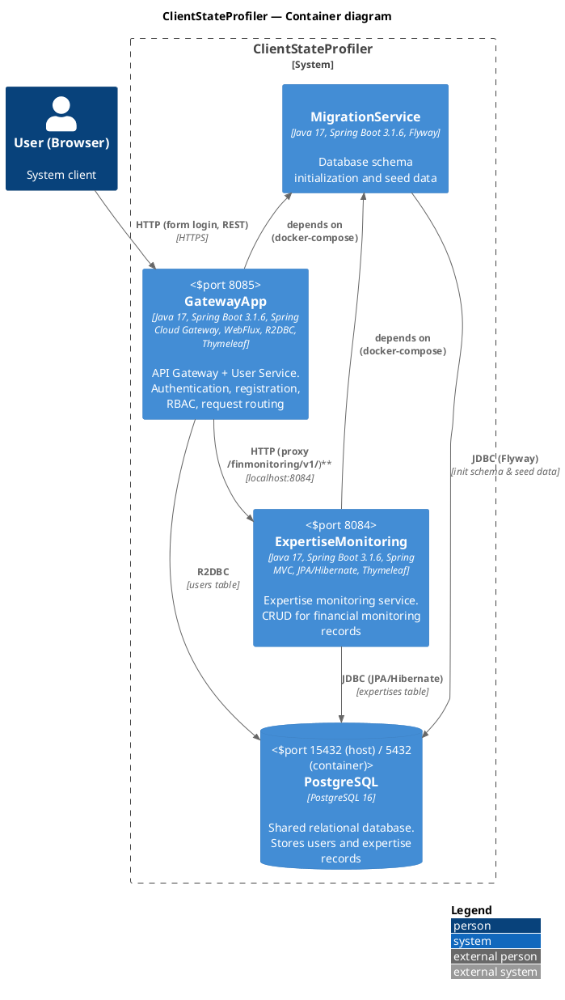

# ClientStateProfiler Architecture

## Overview

**ClientStateProfiler** is an educational Java microservice project for monitoring the state of financial institution clients. The system provides user management and expertise (financial monitoring) records with role-based access control.

---

## PlantUML Architecture Diagram



---

## Component Breakdown

### 1. GatewayApp (Gateway + User Service)

| Characteristic | Value |
|---|---|
| Port | `8085` |
| Technologies | Spring Cloud Gateway, WebFlux, R2DBC, Reactive Spring Security, Thymeleaf, Lombok, Jasypt |
| Stack | **Reactive Stack** |

**Responsibilities:**
- User authentication (form login with Spring Security)
- New user registration (POST `/users/v1/users`)
- Request proxying to ExpertiseMonitoring via `/finmonitoring/v1/**`
- Role-Based Access Control (RBAC):
    - `ROLE_USER` — basic access
    - `ROLE_MONITORING_USER` — access to financial monitoring service
    - `ROLE_ADMIN` — full access to all users

**Key classes:**
| Class | Purpose |
|---|---|
| `GatewayApp.java` | Entry point, `@SpringBootApplication`, `@EnableEncryptableProperties` |
| `SecurityConfiguration.java` | WebFlux Security configuration: filter chain setup, endpoint access rules |
| `SecurityPathsProperties.java` | External security path configuration via `security.paths.*` in `application.yml` |
| `PassConfiguration.java` | `PasswordEncoder` bean (BCrypt) |
| `AuthController.java` | REST API `/users/v1/users` — user CRUD |
| `IndexController.java` | Login page rendering `/login` |
| `SignUpController.java` | Registration page rendering `/signup` |
| `AboutMeController.java` | Current user info display `/users/v1/user_authorities` |
| `UserServiceImpl.java` | `ReactiveUserDetailsService` and `UserService` implementation |
| `UserRepo.java` | Reactive CRUD Repository (R2DBC) |
| `User.java` | User entity, implements `UserDetails` |
| `UserDto.java` | Record for user data transfer |
| `UserRequestBody.java` | Record for registration request body |
| `UserRoles.java` | Enum with roles |
| `UserAlreadyExistException.java` | Exception for duplicate login |

---

### 2. ExpertiseMonitoring (Expertise Monitoring Service)

| Characteristic | Value |
|---|---|
| Port | `8084` |
| Technologies | Spring MVC, JPA/Hibernate, Thymeleaf, Validation, Lombok, Jasypt |
| Stack | **Servlet Stack** |

**Responsibilities:**
- CRUD operations for financial monitoring expertise records
- Search expertises by ID and ClientId
- Display results via Thymeleaf templates

**Key classes:**
| Class | Purpose |
|---|---|
| `MonitoringExpertiseApplication.java` | Entry point |
| `MonitoringExpertiseConfiguration.java` | Configuration: `HiddenHttpMethodFilter` for `PATCH`/`DELETE` support in forms |
| `ExpertiseMonitoringController.java` | MVC controller: `GET/POST/PATCH/DELETE /finmonitoring/v1/expertises` |
| `ExpertiseMonitoringServiceImpl.java` | Service implementation with transactional logic |
| `ExpertiseMonitoringRepository.java` | JPA Repository with `findByClientId`, `deleteById` methods |
| `ExpertiseMonitoring.java` | JPA entity for `EXPERTISES` table |
| `ExpertiseMonitoringDto.java` | Record for expertise data transfer |
| `ExpertiseType.java` | Enum of expertise types: `TURNOVER_INCREASE`, `ACCOUNT_LOCK`, `SUPPLIER_LOSS` |

**Thymeleaf templates:**
| Template | Purpose |
|---|---|
| `expertises_main.html` | Main menu of the expertise service |
| `found_res.html` | Search results (table with records) |
| `save_res.html` | New expertise creation form |
| `upd_res.html` | Expertise editing form |

---

### 3. MigrationService (Migration Service)

| Characteristic | Value |
|---|---|
| Technologies | Spring Boot, Flyway, PostgreSQL JDBC |
| Type | **Ephemeral** (terminates after migration) |
| Dependency | Starts after PostgreSQL is healthy |

**Responsibilities:**
- Database schema creation (tables `USERS` and `EXPERTISES`)
- Initial seed data population

**Migrations:**
| File | Description |
|---|---|
| `V01__CREATE_USERS.sql` | Insert test users (Leo, Max, Marco, Karl) with BCrypt passwords |
| `V02__CREATE_EXPERTISES.sql` | Insert test expertise records (5 entries) |

---

## Database Schema

### USERS table (GatewayApp → R2DBC)

```sql
CREATE TABLE USERS (
    id BIGINT PRIMARY KEY GENERATED ALWAYS AS IDENTITY,
    login VARCHAR(30) NOT NULL,
    password VARCHAR(60) NOT NULL,
    granted_authority VARCHAR(30) NOT NULL
);
```

| Field | Type | Description |
|---|---|---|
| id | BIGINT (PK) | Auto-increment ID |
| login | VARCHAR(30) | Unique username |
| password | VARCHAR(60) | BCrypt password hash |
| granted_authority | VARCHAR(30) | User role |

### EXPERTISES table (ExpertiseMonitoring → JPA/Hibernate)

```sql
CREATE TABLE EXPERTISES (
    id BIGINT PRIMARY KEY GENERATED ALWAYS AS IDENTITY,
    expertise_type VARCHAR(30) NOT NULL,
    client_id VARCHAR(36) NOT NULL,
    status VARCHAR(30) NOT NULL,
    comment VARCHAR(1000),
    dt_expertise_status TIMESTAMP NOT NULL
);
```

| Field | Type | Description |
|---|---|---|
| id | BIGINT (PK) | Auto-increment ID |
| expertise_type | VARCHAR(30) | Expertise type (enum) |
| client_id | VARCHAR(36) | Client UUID |
| status | VARCHAR(30) | Processing status |
| comment | VARCHAR(1000) | Comment |
| dt_expertise_status | TIMESTAMP | Last modification timestamp |

---

## Role Model and Security

### Role Types

| Role | Access Rights |
|---|---|
| `ROLE_USER` | Access to own information (`/users/v1/user_authorities`, `/selfinfo`) |
| `ROLE_MONITORING_USER` | All `ROLE_USER` rights + full access to expertise service (`/finmonitoring/v1/**`) |
| `ROLE_ADMIN` | All rights + view all users (`GET /users/v1/users`) |

### Security Mechanisms
- **Authentication:** HTTP Basic + Form Login (Spring Security)
- **Password hashing:** BCrypt (strength 10)
- **Configuration encryption:** Jasypt Spring Boot Starter (password: `commonpoint`)
- **CSRF:** Disabled for REST API
- **Authorization:** Reactive `SecurityWebFilterChain` with `pathMatchers` and role checks

### Security Path Configuration (GatewayApp application.yml)

```yaml
security:
  paths:
    public-get: ['/login', '/signup', '/logout', '/*.css']
    public-post: ['/users/v1/users']
    authenticated-get: ['/users/v1/users/*', '/logout', '/', '/selfinfo', '/users/v1/user_authorities']
    admin-get: ['/users/v1/users']
    monitoring-get: ['/finmonitoring/v1/*', '/finmonitoring/v1/*/*', '/expertises', '/found_res', ...]
    monitoring-post: ['/found_res', '/finmonitoring/v1/*', '/finmonitoring/v1/*/*', '/index']
```

---

## Gateway → ExpertiseMonitoring Routing

GatewayApp (Spring Cloud Gateway) routes requests to ExpertiseMonitoring via:

```yaml
spring:
  cloud:
    gateway:
      routes:
        - id: finmonitoring
          uri: http://localhost:8084
          predicates:
            - Path=/finmonitoring/v1/**
```

---

## Docker Infrastructure

### docker-compose Services

| Service | Build Context | Ports | Dependencies |
|---|---|---|---|
| `db_postgres_client_profiler` | — | `15432:5432` | — |
| `migrate` | `../MigrationService/` | — | db (healthy) |
| `expertise_monitoring` | `../ExpertiseMonitoring/` | `8084:8084` | db (healthy) |
| `gateway_app` | `../GatewayApp/` | `8085:8085` | db (healthy), expertise |

### Environment Variables
- `.env` — for DB and Flyway: `POSTGRES_USER=mike1`, `POSTGRES_PASSWORD=nnm`
- `.env_sc` — for Jasypt: `jasypt.encryptor.password=commonpoint`

### Multi-stage Dockerfile
- All services use multi-stage build: **build** (maven:3-eclipse-temurin-17) → **runtime** (openjdk:17)
- Migrations run via Flyway on `MigrationService` startup

---

## API Endpoints

### GatewayApp (port 8085)

| Method | Path | Access | Description |
|---|---|---|---|
| GET | `/login` | Public | Login page |
| GET | `/signup` | Public | Registration page |
| POST | `/users/v1/users` | Public | User registration |
| GET | `/users/v1/users` | ADMIN | List all users |
| GET | `/users/v1/users/{id}` | Authenticated | Get user by ID |
| GET | `/users/v1/user_authorities` | Authenticated | Current user info |
| GET | `/` | Authenticated | Main page with services |
| GET | `/selfinfo` | Authenticated | Self information |

### ExpertiseMonitoring (port 8084, proxied through Gateway)

| Method | Path | Access | Description |
|---|---|---|---|
| GET | `/finmonitoring/v1/expertises` | MONITORING | Search expertises (by id or clientId) |
| POST | `/finmonitoring/v1/expertises` | MONITORING | Create new expertise |
| PATCH | `/finmonitoring/v1/expertises` | MONITORING | Edit expertise |
| DELETE | `/finmonitoring/v1/expertises/{id}` | MONITORING | Delete expertise |
| GET | `/finmonitoring/v1/expertises_main` | MONITORING | Expertise main menu |
| GET | `/finmonitoring/v1/save_res` | MONITORING | Create expertise form |
| GET | `/finmonitoring/v1/upd_res` | MONITORING | Edit expertise form |

---

## Test Credentials

| Username | Password | Role |
|---|---|---|
| Leo | BCrypt | `ROLE_USER` |
| **Max** | **rewq21** | **`ROLE_MONITORING_USER`** |
| Marco | BCrypt | `ROLE_USER` |
| Karl | BCrypt | `ROLE_ADMIN` |

> For full access to expertises, use **Max / rewq21**.

---

## Technology Stack (Summary)

| Technology | Version | Usage |
|---|---|---|
| Java | 17 | Development language |
| Spring Boot | 3.1.6 | Framework |
| Spring Cloud Gateway | 2022.0.3 | API Gateway |
| Spring WebFlux | 3.1.6 | Reactive stack (GatewayApp) |
| Spring MVC | 3.1.6 | Servlet stack (ExpertiseMonitoring) |
| Spring Data R2DBC | 3.1.6 | Reactive database access |
| Spring Data JPA / Hibernate | 3.1.6 | ORM (ExpertiseMonitoring) |
| Spring Security (Reactive) | 3.1.6 | Authentication and RBAC |
| Thymeleaf | 5.x | Template engine (Frontend) |
| Flyway | 10.7.1 | Database migrations |
| PostgreSQL | 16 | Relational database |
| Lombok | 1.18.x | Code generation |
| Jasypt Spring Boot Starter | 2.1.2 | Configuration encryption |
| Docker / Docker Compose | — | Containerization |
| BCrypt | — | Password hashing |
| Maven | 3.x | Project build |

---

## Architecture Principles and Patterns

1. **API Gateway pattern** — GatewayApp serves as a single entry point, hiding internal architecture
2. **Database per service (shared database)** — services share a common database but each works with its own table
3. **Reactive stack + Servlet stack** — hybrid approach: GatewayApp on WebFlux, ExpertiseMonitoring on Spring MVC
4. **RBAC (Role-Based Access Control)** — role-based access differentiation
5. **Separation of concerns** — clear division: Gateway (authentication + routing), Expertise (business logic), Migration (initialization)